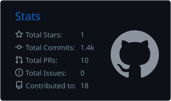
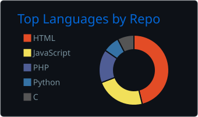
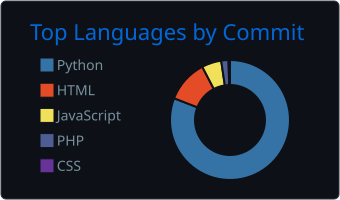
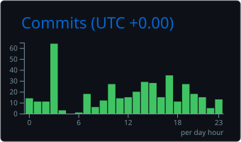

<h1 align="center">
  
</h1>

  
  
  

  

 

# 👨‍💻 Reşit ASRAV
### Computer Engineering Student | Embedded Systems & Autonomous Technologies

I am a Computer Engineering student focused on specializing at the intersection of hardware and software, particularly in autonomous systems and embedded development. I enjoy low-level system optimization, real-time architectures, and building scalable backend infrastructures for complex applications.

---

### 🚀 Strategic Focus Areas

- 🛰️ **Autonomous Systems:** PX4 Autopilot, Gazebo simulations, MAVLink communication protocols, and SITL-based validation.
- 💾 **Embedded Software:** Bare-metal and RTOS-based development using C/C++, STM32 microcontrollers, and SBC platforms such as Orange Pi.
- ⚙️ **System Architecture:** Scalable backend systems with Django, RESTful API design, and database performance optimization.

---

### 🛠️ Technical Competencies

**Programming Languages**  
   

**Embedded & Robotics**  
    

**Web & Backend**  
   

**Tools & Operating Systems**  
     

---

### 📊 GitHub Stats & Insights

  
  
   
  
  
   
  

 

  
  

---

<!-- HISTORY_START -->
### 📅 On This Day

**June 02 — 2023:** A collision between two passenger trains and a parked freight train near the city of Balasore, Odisha, in eastern India resulted in 296 deaths and more than 1,200 people injured.
🔗 [Wikipedia](https://en.wikipedia.org/wiki/2023_Odisha_train_collision)

🇹🇷 Türkçe Çevirisi

**02 Haziran - 2023: Hindistan'ın doğusundaki Odisha'nın Balasore kenti yakınlarında iki yolcu treni ile park halindeki bir yük treni arasındaki çarpışma 296 kişinin ölümüyle ve 1.200'den fazla kişinin yaralanmasıyla sonuçlandı.**

*Updated: 2026-06-02 11:18 UTC*
<!-- HISTORY_END -->

---

<!-- LEETCODE_START -->
### 💻 LeetCode — Problem of the Day

**[Earliest Finish Time for Land and Water Rides I](https://leetcode.com/problems/earliest-finish-time-for-land-and-water-rides-i/)**  
Difficulty: 🟢 Easy  
Topics: `Array, Two Pointers, Binary Search, Greedy`

🇹🇷 Türkçe Çevirisi

**[Kara ve Su Sürüşlerinde En Erken Bitiş Zamanı I](https://leetcode.com/problems/earliest-finish-time-for-land-and-water-rides-i/)**  
Zorluk: 🟢 Easy  
Konular: `Dizi, İki İşaretçi, İkili Arama, Açgözlü`

*Updated: 2026-06-02 11:18 UTC*
<!-- LEETCODE_END -->

---

<!-- AINEWS_START -->
### 🤖 AI & Tech — Top Stories

1. **[Adobe Sensei – Unified artificial intelligence and machine learning](http://www.adobe.com/sensei.html)** ⬆️ 12

🇹🇷 Türkçe Çevirisi

**Adobe Sensei – Birleşik yapay zeka ve makine öğrenimi**

2. **[Best Artificial Intelligence and Machine Learning Books](https://hackernoon.com/5-best-artificial-intelligence-machine-learning-books-in-2019-cc8b38f6ec8e)** ⬆️ 12

🇹🇷 Türkçe Çevirisi

**En İyi Yapay Zeka ve Makine Öğrenimi Kitapları**

3. **[Artificial Intelligence and Machine Learning in Software as a Medical Device](https://www.fda.gov/medical-devices/software-medical-device-samd/artificial-intelligence-and-machine-learning-software-medical-device)** ⬆️ 11

🇹🇷 Türkçe Çevirisi

**Tıbbi Cihaz Olarak Yazılımda Yapay Zeka ve Makine Öğrenimi**

*Updated: 2026-06-02 11:18 UTC*
<!-- AINEWS_END -->

---

<!-- NEWS_START -->
### 🌍 Breaking News — BBC World

_This section is auto-updated by GitHub Actions._

<!-- NEWS_END -->

---

### 🐍 Contribution Snake

  <picture>
    <source media="(prefers-color-scheme: dark)" srcset="https://raw.githubusercontent.com/resitasrav/resitasrav/output/drone-snake-dark.svg">
    <source media="(prefers-color-scheme: light)" srcset="https://raw.githubusercontent.com/resitasrav/resitasrav/output/drone-snake-light.svg">
    
  </picture>

---

> _"The future belongs to autonomous systems — and autonomous systems are shaped by precise algorithms."_
