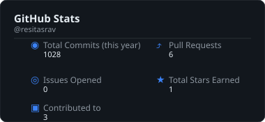
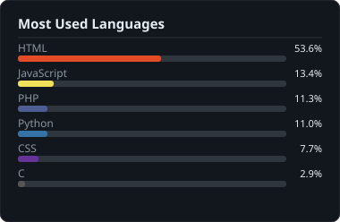
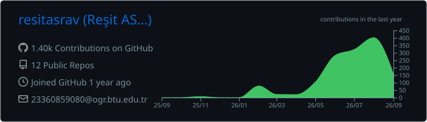

<div align="center">


<br/>

[](https://www.linkedin.com/in/resitasrav)
[](mailto:resitasrav@gmail.com)
[](https://github.com/resitasrav/resitasrav/raw/main/ResitAsrav_CV.pdf)
[](https://github.com/resitasrav)

</div>

---

## 👨‍💻 About

Computer Engineering student focused on the convergence of hardware and software.  
Building systems that operate at the edge — from bare-metal embedded firmware to autonomous aerial platforms.

| | |
|:---|:---|
| 🎓 | Computer Engineering Student |
| 🛰️ | Autonomous systems — PX4, MAVLink, SITL |
| 💾 | Embedded firmware — STM32, RTOS, C/C++ |
| ⚙️ | Backend infrastructure — Django, REST APIs, Docker |
| 📍 | Turkey |

---

## 🎯 Current Focus

```text
▸ Drone autonomy     — PX4 Autopilot · MAVLink protocols · Gazebo SITL
▸ Embedded systems   — STM32 bare-metal · FreeRTOS · real-time constraints
▸ Backend            — Django REST APIs · containerized deployments
```

---

## 🛠️ Tech Stack

<details>
<summary><b>Languages</b></summary>
<br>


</details>

<details>
<summary><b>Embedded &amp; Autonomous Systems</b></summary>
<br>


</details>

<details>
<summary><b>Backend &amp; Infrastructure</b></summary>
<br>


</details>

---

## 📊 GitHub Stats

<div align="center">
  
  &nbsp;&nbsp;
  
</div>

<div align="center">
  
</div>

---

## 📡 Live Feed

<!-- HISTORY_START -->
### 📅 On This Day

**June 14 — 2017:** A fire severely damaged Grenfell Tower in North Kensington, London, killing 72 people.  
🔗 [Read on Wikipedia](https://en.wikipedia.org/wiki/Grenfell_Tower_fire)
<details>
<summary>🇹🇷 Türkçe Çevirisi</summary>

**14 Haziran 2017: Londra'nın Kuzey Kensington kentindeki Grenfell Tower'da çıkan yangında 72 kişi öldü.**

</details>

*Updated: 2026-06-14 09:18 UTC*
<!-- HISTORY_END -->

---

## 🐍 Contribution Snake

<div align="center">
  <picture>
    <source media="(prefers-color-scheme: dark)"  srcset="https://raw.githubusercontent.com/resitasrav/resitasrav/output/drone-snake-dark.svg">
    <source media="(prefers-color-scheme: light)" srcset="https://raw.githubusercontent.com/resitasrav/resitasrav/output/drone-snake-light.svg">
    
  </picture>
</div>

---

<div align="center">

*"The future belongs to autonomous systems — and autonomous systems are shaped by precise algorithms."*

</div>
